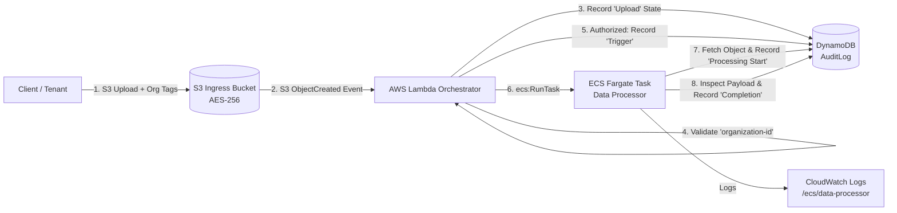

# Secure Data Orchestrator & Hybrid Relay (AWS) ☁️🔒

[](https://github.com/Toya62/secure-data-orchestrator-aws/actions/workflows/ci.yml)
[](https://www.terraform.io)
[](https://www.python.org)
[](https://aws.amazon.com)
[](https://opensource.org/licenses/MIT)

A cloud-native, event-driven data ingestion, validation, and immutable audit pipeline built on **AWS**. Engineered with **Terraform**, **AWS Lambda**, **ECS Fargate**, **Amazon DynamoDB**, and **S3**, featuring an architectural blueprint for **Hybrid On-Premises Relays (MinIO / Ceph)**.

---

## 🏗️ Architecture Overview

The system automates multi-tenant data ingress, enforces compliance tag validation, triggers containerized batch processing, and maintains an auditable state-machine log for every file transaction.



---

## 🚀 Key Architectural Features

- **Event-Driven Orchestration**: Uploads to S3 automatically trigger serverless validation via AWS Lambda without maintaining polling infrastructure.
- **Zero-Trust Tag Validation**: Ingress files must carry a verified `organization-id` object tag. Missing or malformed tags immediately flag an audit violation and halt execution.
- **Immutable Audit Trail**: DynamoDB tracks state transitions across the full lifecycle:
  $$\text{Upload} \longrightarrow \text{Validation} \longrightarrow \text{Trigger} \longrightarrow \text{Processing Start} \longrightarrow \text{Completion / Failed}$$
- **Serverless Compute Decoupling**: Lightweight validation runs on AWS Lambda, while heavy or prolonged processing executes in isolated **ECS Fargate** tasks with dedicated vCPU/Memory allocations.
- **Security & Least-Privilege IAM**:
  - S3 encrypted at rest via **AES-256 (SSE-S3)** with public access completely blocked.
  - Granular IAM policies restrict Lambda and ECS tasks to minimum required ARNs.
- **Hybrid Cloud & Data Sovereignty Strategy**: Includes an architectural strategy ([`docs/Hybrid_Strategy.md`](docs/Hybrid_Strategy.md)) showing how storage and compute can be decoupled for member organizations requiring on-premises MinIO storage and local container agents.

---

## 📁 Repository Structure

```text
secure-data-orchestrator-aws/
├── .github/
│   └── workflows/ci.yml       # Automated CI (Python unit tests + Terraform validation)
├── docs/
│   └── Hybrid_Strategy.md     # Decoupling on-prem storage (MinIO) and local compute
├── infra/
│   └── main.tf                # Complete Terraform Infrastructure as Code (IaC)
├── src/
│   ├── lambda/
│   │   └── index.py           # Ingress event validation & ECS task orchestrator
│   └── processor/
│       ├── Dockerfile         # Container definition for ECS Fargate batch processor
│       ├── processor.py       # Core payload processing and DynamoDB audit logger
│       └── requirements.txt   # Container dependencies (boto3)
├── tests/
│   └── test_orchestration.py  # Automated unit tests for Lambda & Processor
├── LICENSE                    # MIT License
└── README.md                  # System overview and deployment guide
```

---

## 🛠️ Deployment Guide (Terraform)

### Prerequisites
- [AWS CLI](https://aws.amazon.com/cli/) configured (`aws configure`)
- [Terraform >= 1.5.0](https://developer.hashicorp.com/terraform/install)
- [Docker](https://www.docker.com/)

### 1. Provision AWS Infrastructure
```bash
cd infra
terraform init
terraform apply -auto-approve
```
*Outputs will display `s3_bucket_name`, `ecr_repository_url`, `dynamodb_audit_table`, and `ecs_cluster_name`.*

### 2. Build and Push Processor Container to ECR
```bash
cd ../src/processor

# Authenticate Docker to Amazon ECR
aws ecr get-login-password --region <region> | docker login --username AWS --password-stdin <ecr_repository_url>

# Build, tag, and push container
docker build -t data-processor .
docker tag data-processor:latest <ecr_repository_url>:latest
docker push <ecr_repository_url>:latest
```

### 3. Trigger and Verify Ingestion
Upload a sample archive with the mandatory `organization-id` tag:
```bash
touch test.zip && zip test.zip test.zip
aws s3api put-object \
  --bucket <s3_bucket_name> \
  --key test.zip \
  --body test.zip \
  --tagging "organization-id=org-alpha-42"
```

1. **Query DynamoDB Audit Log**:
   Inspect table `AuditLog` to view the chronological progression (`Upload` $\rightarrow$ `Trigger` $\rightarrow$ `Processing Start` $\rightarrow$ `Completion`).
2. **View CloudWatch Logs**:
   ```bash
   aws logs tail /ecs/data-processor --follow
   ```

---

## 🧪 Automated Testing

Unit tests use Python's built-in `unittest.mock` to validate Lambda event processing, tagging constraints, ECS invocations, and DynamoDB audit states without requiring live AWS credentials:

```bash
python3 -m unittest discover -s tests -v
```

### Validation Test Matrix
- ✅ **Valid Ingress**: Verifies S3 event triggers `Upload` audit, validates `organization-id`, logs `Trigger`, and runs ECS task.
- ✅ **Tag Enforcement**: Verifies untagged uploads fail validation, record failure audit, and abort execution.
- ✅ **Processing Completion**: Verifies processor starts, inspects payload size, and writes `Completion` record.
- ✅ **Error Resiliency**: Verifies S3 access errors record `Processing Failed` in DynamoDB gracefully.

---

## 📄 License
This project is open-source and licensed under the [MIT License](LICENSE).
